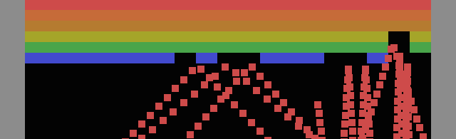

# BREAKSOUT

# [Play Online](https://pippinbarr.github.io/breaksout/) (desktop and mobile)

## Description
*What’s better than breaking out?! BREAKSING OUT! Breaks out to your heart’s content in these wonderful variants of your old family friend! Snake it up in SNAKEOUT! Feel the love in GHOST BREAKOUT! Experience the future of entertainment in BREAKOUT VR! Or have a meaningful cultural experience with РАЗРАЗИТЬСЯ!*

_BREAKSOUT_ was written in JavaScript/HTML5 using the [Phaser](http://phaser.io/) game framework. Sounds were created in [bfxr](http://www.bfxr.net/) and music was created in [Bosca Ceoil](http://distractionware.com/blog/2013/08/bosca-ceoil/). _BREAKSOUT_ is doing its best to be touch-based mobile-friendly, but your mileage may vary.

## Documentation
* Read the [Process Documentation](../process)
* Look at the [Code Repository](https://github.com/pippinbarr/breaksout) for source code etc.

## Press
Read the [Press Kit](../press) for press information

* [Kill Screen](http://killscreendaily.com/articles/pippin-barr-alludes-creative-possibilities-games-breaking-breakout/)
* [Rock, Paper, Shotgun](http://www.rockpapershotgun.com/2015/10/02/breaksout-36-breakout-variants/)
* [FreeIndieGa.me](http://freeindiega.me/post/130542464700/breaksout-by-pippin-barr-36-jokes-told-through)
* [Superlevel](https://superlevel.de/spiele/breaksout-the-winner-breaks-it-all/)
* [Geek Squad](http://www.geeksquad.co.uk/articles/Gaming/2012/08/top_10_free_pc_games)
* [L'Oujevipo](http://oujevipo.fr/general/4842-breaksout/)
* [Forest Ambassador](http://forestambassador.com/post/133594907025/breaksout-is-a-game-about-breakout-by-pippin-barr)
* [CatCubed](https://catcubedblog.wordpress.com/2015/10/11/breaking-out/)

## License
*BREAKSOUT* is licensed under a [Creative Commons Attribution-NonCommercial 3.0 Unported License](http://creativecommons.org/licenses/by-nc/3.0/).
