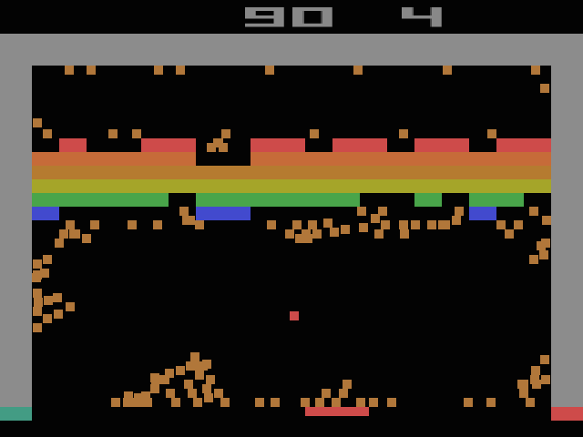

# *BREAKSOUT*

## Information
* Released: 1 October 2015
* Website: http://www.pippinbarr.com/
* Platforms: Browser
* Link: https://www.pippinbarr.com/breaksout/info
* Price: Free.

## Description
What's better than breaking out?! BREAKSING OUT! Breaks out to your heart's content in these wonderful variants of your old family friend! Snake it up in SNAKEOUT! Feel the love in GHOST BREAKOUT! Experience the future of entertainment in BREAKOUT VR! Or have a meaningful cultural experience with РАЗРАЗИТЬСЯ!

## History
BREAKSOUT is the sequel to PONGS, a game which contained 36 versions of PONG. BREAKSOUT contains 36 versions of BREAKOUT. That's how that works. It's 36 because that's the number of alphanumeric characters on my keyboard. PONGS came about on a flight from Greece to Denmark as a way of passing the time by coming up with amusing variants of PONG. BREAKSOUT was designed in a farmhouse while on holiday in Gozo, Malta. BREAKSOUT took far too long to finish because I was simultaneously settling into Montréal, Canada and a new and intense job. As a scholar-in-residence. Even though that sounds like I just lounge around on a sofa or something.

## Features
* Haunting
* Artificial life
* Paddles
* Charles Dickens
* Snakes

## Images

## Trailer
[View the Trailer on YouTube](https://www.youtube.com/watch?v=3MnkKpYW56A)

## Credits
* Pippin Barr: Everything
