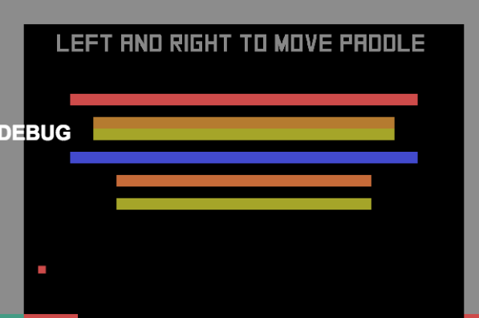
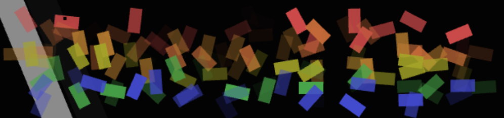
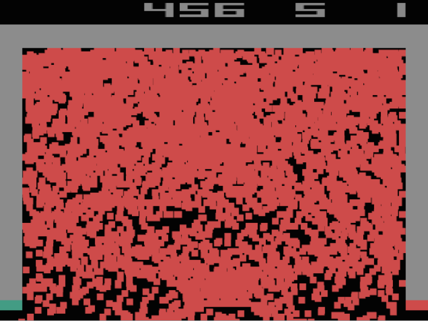

# Blog Posts

Here are public-facing blog posts I wrote about the game.

## Big Exciting Game Announcement (BEGA): BREAKSOUT (2015-08-01)

Why hello there. Over the last <amount of time> I've gotten into the habit of not really talking/writing about the projects I'm actually working on, and I've decided to not do that anymore. I think it maybe even came from some inane sense of privacy or &#8216;intellectual property' or something? Paranoia! What's that even about? It's not like many people read this blog in the first place! And even you lovely types who do, what do I have to hide from you? Nothing.

So, anyway, I'm starting on a kind of sequel to _[PONGS](http://www.pippinbarr.com/games/pongs/Pongs.html)_ called _BREAKSOUT. _If you're familiar with _PONGS_ you may be able to guess that _BREAKSOUT_ will consist of numerous (36, to be precise) versions of the game _BREAKOUT_. Once again, the idea is to explore small changes to a very simple game to see how they alter the experience, whether they're formal rule changes, aesthetic changes, or something else again. _PONGS_ was an important game for me in that it was a way to see what a game is &#8216;made of', in a sense, and functioned as the closest thing to an experimental game (in the scientific sense at least) that I've put together.

Coming up with the different subgames for _BREAKSOUT_ has been deeply satisfying, I must say, and it's one of those projects that seems like it will be &#8216;easy' (read: I'll discover it actually takes me like a year to make). _PONGS_ was actually made in about a week, but I don't think I'll be able to match that, not least of all because I'm busy settling into Montréal and because I'm making _BREAKSOUT_ in HTML5 with mobile in mind etc., complicating matters.

More generally speaking, I'm obsessed with _BREAKOUT_ as a base-case for &#8216;making a game' at the moment, in part because Rilla and I massively failed to make a _BREAKOUT_-based game for a game jam in Malta recently. It set me on this intense journey of _BREAKOUT_-discovery, coming up with three different approaches to make (including _BREAKSOUT_). That, along with _[Two Player Breakout](http://www.pippinbarr.com/2012/03/03/two-player-breakout/)_ and _[Sound System II](http://www.pippinbarr.com/2015/03/13/sound-system-ii/)_ make me a real _BREAKEROUTER._

Anyway, that's the project. I already have 36 variations in mind. I'm excited about building it. Now you know what I am doing. You can rest easy.

Rest, weary stranger.

## You Can Design, But Can you Edit Edit Edit? (2015-08-02)

I've been working &#8216;properly' on _BREAKSOUT_ for the last couple of days. Mostly that's just been solving super-boring technical things I generally have to solve and re-solve every time I decide to make anything, because I'm forgetful and disorganised I suppose. In this case it was: 1) remembering how to do inheritance in JavaScript (I fixed this but don't know why it works. Typical.); 2) getting gyroscope controls to work (which they sort of do? Enough I guess?); 3) making the game size nicely for both desktop and mobile browsers (seems okay).

One of the most fun but also difficult things about games like _PONGS_ and _BREAKSOUT_ is that they very specifically require me to do that thing all those very smart and established game designers are always saying: "have lots of ideas" "ideas are a dime a dozen" "ideas ideas ideas". So while holidaying in Malta I had a bunch of ideas for versions of _BREAKOUT_ and wrote them in my notebook.

But the other sad thing about having lots of ideas is that you have to _edit_ them, because, between you and me, they aren't all gold. Thus, out of about 40 versions of _BREAKOUT_ I had in the notebook I had to drop around 15-20 of them and come up with new ideas to build back up to 36 (my magical number for this game).

It's kind of painful admitting to yourself that a design idea (even a tiny little one like the _BREAKSOUT_ games) is kind of terrible or, even worse, just mediocre. Working on _BREAKSOUT_ means having that feeling many, many times in quick succession. So, for example, I dropped things like _GHOST BREAKOUT_ because it was just a derivative idea from _PONGS_ (being derivative of _myself_ no less!), dropped _NARRATIVE BREAKOUT_ because it sucked and was boring, dropped _REAL PHYSICS BREAKOUT 2_ because I don't know what the hell I meant by it, and so on and so forth. Painful admissions all.

But in all cases I usually came up with something better. Or sometimes came up with something _slightly_ better, then edited that one out as well, then came up with something _actually better_. So it works out – that magical number 36 means you have no choice but to turn the crank handle until all your ideas are strong. (Where &#8216;strong' means simply that I find them successfully amusing.)

The happiest story in all this was actually _GHOST BREAKOUT_. The original idea was just the same as in _PONGS_: you start playing with a semi-transparent paddle and it turns out the paddle is a &#8216;ghost' and the ball goes right through it. Hilarity ensues. I realised I could replace this with... _GHOST BREAKOUT_, in which Unchained Melody starts playing and an invisible and loving force helps to guide your paddle to the right place.

All of this is called game design.

&nbsp;

## The Exquisite Disappointment of 'Truth' in a Very Specific Case (2015-08-04)

A lot of what I tend to feel really bound up in when making games is some notion of the &#8216;truth' of the game I'm making. By which I mean that generally there's some very specific core idea I'm exploring, and the whole game (and accompanying design and code decisions) need to be bound by that &#8216;truth'. This is even advice I gave to some people today, so I even stand by my word? Who knew?

The thing about this &#8216;truth' though is it can also bite you in the ass, which is has been doing this evening.

One of the versions of _BREAKOUT_ I'm making in _BREAKSOUT_ is based on [Conway's Game of Life](https://en.wikipedia.org/wiki/Conway%27s_Game_of_Life), where the bricks act as the cellular automata. Ha ha, pretty great right? I was pleased when I came up with it, so it's encouraging to hear you like it too. After implementing the algorithm, the bricks do indeed cycle through different states of &#8216;life' based on their neighbouring bricks, and you can even hit them while they're going through their paces.

The problem being that within the confines of the screen, six lines of cells leads to total death all the time. The bricks make it through around 10 states before they're all extinguished, whatever you do as a player. Which sucks, because I really wanted a beautiful dancing pattern of life to appear on the screen instead of the usual six rows of bricks.

But that's not how Conway's algorithm works. And since it's called _BREAKOUT OF LIFE_ and the &#8216;truth' involved is implementing Conway's algorithm on the six rows of bricks that appear in a game of _BREAKOUT_ there's really nothing I can do about it. That's where &#8216;truth' gets you sometimes, a cold, dead world. Thanks, &#8216;truth'. Thanks a lot.

(Although in fact six rows _is_ a stable pattern if you change some of the constraints, like how much vertical space the pattern has for example. But that's not the case on a breakout screen so... thanks again, &#8216;truth'.)

(Also, don't you love how all the screenshots have a big white &#8216;DEBUG' on the side? Attractive, I know. I should really disable that.)

&nbsp;

## On 'Principled' Games (2015-08-06)

One thing that causes me a lot of work when I'm making games is that I generally have some particular idea concerning what the game is &#8216;about' (this idea of its &#8216;truth' again) and quite often being true to that idea means a lot of programming and other tasks that nobody will ever see or experience...

So in _[Best Chess](http://www.pippinbarr.com/2015/07/30/best-chess/)_ white plays a move and black proceeds on its merry path of solving chess. Great. Except that not only did I have to write the algorithm for solving chess, I still had to implement all the code that handles what happens _after_ black has solved chess, despite the fact that this will never (practically speaking) actually happen. Thus, were black to solve chess, it would then in fact have the code in place to resign, offer a draw, or play a move (and then solve chess _again_ after white replies!). All that extra stuff will never be seen, but it _has to be there_ out of principle – otherwise it feels like I'm not taking the game in good faith, that I'm sidestepping some &#8216;true' elements of the game that make it what it needs to be.

Similarly, in _[Durations](http://www.pippinbarr.com/games/durations/)_ there were many minigames that would obviously never be completed. Take _One Millennium Avant Garde Band_ for instance &#8211; not a game anyone is actually going to complete, one assumes. _And yet_ that game does contain the code such that, after 1,000 years have elapsed, the curtain comes down on the stage. If that code wasn't there, if the game didn't handle its end-state (even if that's a millennium away), it just wouldn't be right, right?

Today I've been working on another _BREAKOUT_ for _BREAKSOUT_ which involves the different rows of bricks being &#8216;in' different cities in the world. So the lowest row is &#8216;in' Montréal and can only be cleared if you're playing there, the next row is &#8216;in' Istanbul, and so on. Once again, nobody is realistically going to start the game (in Montréal, presumably), break the first row, then, leaving the game running, fly to Turkey to break the second row, and so on, but the game has to be implemented, _in code_, to account for it all. This ended up being to the extent that, because the [free Google geocoding service](https://developers.google.com/maps/documentation/geocoding/intro) only allows 2,500 look-ups a day, I limited the geocoding of any single instance of the game to just once a day, you know, just in case a couple thousand people actually want to travel around playing this game. It's in the game.

All of these implementation details are kind of useless in that they will (almost certainly) never actually be experienced or seen by anybody (including me, in terms of their real contexts rather than just manipulated testing contexts). And yet if the code weren't there to handle these things, the games would be frauds, unprincipled digital scam-artists. And that would be sad indeed.

It's the principle of the thing, after all.

## Thank Goodness for Formality (2015-08-13)

Briefly, I have been reminded several times over the last couple of weeks what a good thing it is to be &#8216;working on' a game like _BREAKSOUT_ specifically because it's so formal and well-defined. Moving to a new country and city and university and heading toward teaching new courses is not exactly the most and calm and collected time of life, so I've definitely been distracted and busy enough to make it hard to put nearly as much time into game making as I would ordinarily.

The fact that _BREAKSOUT_ is just a series of fairly simple modifications to _BREAKOUT_ means that it's possible to literally work on it for a ten minute block if that's all I have – some of the versions take less that than to implement to be honest. This way, I get to feel like I'm still pushing a project forward (I'm kind of hoping to finish it within this month if at all possible), but can also devote the attention needed to actually getting life and work in order as well.

So maybe one secret to not feeling concerned about productivity is to have a game project on the go which is so mechanically and aesthetically simple that any window of time is sufficient to progress it. I can even imagine putting this into action, as I do have ideas for other formal sets of games. _SPACE INVADERSES_ anyone?

## ░░░░ Physics (2015-08-14)

So, physics. What's up with that? Gravity. Ha ha, no, gravity's not specifically &#8216;up'. I don't think? Or is it? No I don't think so.

Anyway, I have never gotten on with physics in games, it's just not a relationship that ever seems to work out. The typical way it goes is that I spend inordinate amounts of time on things that should be easy because of physics engines, and they don't work. We're talking weeks or months sometimes, people. And then, admittedly, towards the end of that horrorshow I do end up with something that &#8216;works', but it's ridiculously too much effort. I'm not sure if it's one of those things where I should just sit down and actually learn how physics (programming) works, or whether it's someone else's fault.

I spent some time the last couple of days trying to do _the stupidly simplest thing_ with a _BREAKSOUT_ game, and I never got it. And I mean simple, like getting a ball to bounce off something simple. But no. It didn't work and it still doesn't work and I'm mad as hell and I'm not going to take this anymore.

So I cut that game. Amazing how easy things can be. Having a hard time with your programming? You probably didn't need that feature/game/universe anyway. Screw it. Off it goes, flapping like a rag into the abyss. That felt better, didn't it.

Game making.

&nbsp;

## "BREAKSOUT?" versus BREAKSOUT? (2015-08-17)

I'm plugging away at _BREAKSOUT_ &#8211; roughly 26 exist in some form now and I've pulled together enough of Unchained Melody in Bosca Ceoil for it to sound pretty funny for _GHOST BREAKOUT_. As I do this labour (which, as I've said, is kind of mindless post-design) I sometimes question whether it makes sense to make these games at all.

That is, if the vast majority of interest for me in these games is the design itself, the ideas for the variations, why actually build them? Is the hypothetical set of 36 _BREAKSOUTS_ equivalent to the actually built games?

I say no, and it's important that this be the case. For one thing, I'm actually making them so I don't want to hear about it being pointless. This may bias me. Nonetheless, I also think there's something vital in the experience and interaction with these kinds of designs that makes their implementation necessary. We might well _think_ that we can just thought-experiment our way through what something like _GHOST BREAKOUT_ &#8216;would be like' but I don't think that we really can. The &#8216;Armchair designer' we might call... no wait, that like a regular designer...

Anyway, my thought is that the _experiential_ elements of a game cannot be presumed or even necessarily expected. And even when a _BREAKSOUT_ game &#8216;works' in the way I'd thought, that _feels like_ something that isn't the same thing as having the idea in the first place. Really listening to a lofi Unchained Melody while the paddle gets nudged around by an unseen force has a quality that isn't present in the design itself.

I think there's more to this than I'm managing to articulate, and it's actually quite central to my whole &#8216;practice' of making games in general. Many of the games I've made I could also have told to you as a one-liner kind of joke, or just written a description of, and yet the experience of play adds an understanding/emotion/physicality. And the game can't be &#8216;understood' without it.

It's almost as if game-play is as important as game design or something...

Nah.

## On Failceeding (2015-08-18)

What a horrible word that is. A horrible portmanteau, no less.

Anyway, I thought I would stop in (to my own website, yeah) to write a brief ode to the [Mediterranean Game Jam](http://maltagamejam.com/) that took place back at the start of July this year. Rilla and I participated and managed to get pretty excited about a game that would use retro videogames to tell a story about a person stuck at home trying to stay positive while not actually feeling very good.

We failed pretty hard. By the afternoon of the second day we decided to give up, because we just weren't &#8216;getting it' somehow, and it started to feel pretty clear we didn't quite understand what we were doing. (Despite that, I think there's something in the idea, so maybe it will re-emerge sometime. I love how working with Rilla pushes the kinds of things I'd consider doing in such a different direction.)

So the game jam was kind of a failure in the sense of making a game.

But somehow it got me quite obsessed with Breakout. All I did during the jam itself, really, was build a funny-looking version of Breakout (it did look quite nice), based on iPhone photographs of CRT televisions, which distort in interesting ways because of the beam scanning the screen. But I ended up with Breakout on the brain to such as extent that when we later went for a bit of a vacation on Gozo (the &#8216;other' island of Malta) in a farmhouse, I spent almost all my free time (of which there was plenty) thinking of ways to leverage Breakout.

This ended up with fairly detailed designs for three games entirely premised on Breakout, the first of which is hopefully kind of obviously _BREAKSOUT_ which I'm making at the moment, 36 variations of Breakout as a kind of &#8216;sequel' to _PONGS_. But then I have two whole other projects, one of them surprisingly ambitious (for me), _also_ based on Breakout.

So in brief, falling apart at a game jam in the context of working on Breakout led me to think a lot about Breakout afterwards (much of it in the &#8216;why?! why?!' sense of self-berating) and ultimately to see that Breakout could be quite a strangely versatile way of examining games more generally, that obsessing (through design) over a single game could actually &#8216;say' quite a large potential range of things about game design.

Perhaps.

Anyway, I guess the moral of the story is that if you flame out at a game jam you should beat yourself up about it continuously until you forge a beautiful diamond of design.

RIght? That sounds uplifting enough? A failcess, no less? Good night.

## BREAKSOUT: BROKEN (2015-08-24)

I'm still working away on _BREAKSOUT_ in my sturdy, trudging manner. There are just two more versions to build and then it's over to making sure that the overall package works and smaller bits and pieces. So it's pretty close. Will hope to get it Out There sometime this week or early next.

One nice thing about working on games with even the simplest of physics is you often get to enjoy totally weird imagery generated on screen. This is especially true if you ever generate objects (like balls or bricks) during play. Instead of actually writing something tonight, here are some images of the game not working.

